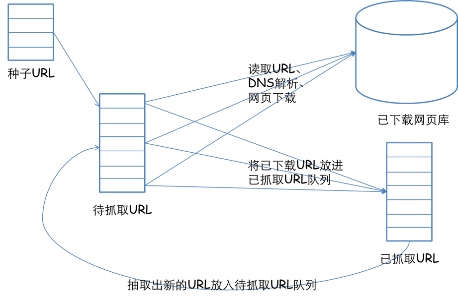
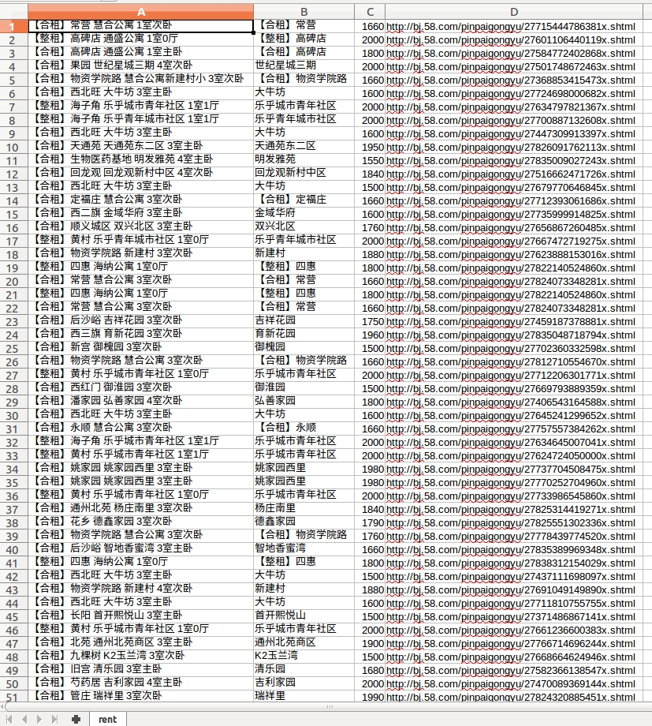

## 有一个专门爬虫的网站:http://www.shenjianshou.cn/

## 网络爬虫基本原理
 网络爬虫是捜索引擎抓取系统的重要组成部分。爬虫的主要目的是将互联网上的网页下载到本地形成一个或联网内容的镜像备份。这篇博客主要对爬虫以及抓取系统进行一个简单的概述。
### 一、网络爬虫的基本结构及工作流程
 一个通用的网络爬虫的框架如图所示：

 
 
     网络爬虫的基本工作流程如下：

- 首先选取一部分精心挑选的种子URL；

- 将这些URL放入待抓取URL队列；

- 从待抓取URL队列中取出待抓取在URL，解析DNS，并且得到主机的ip，并将URL对应的网页下载下来，存储进已下载网页库中。此外，将这些URL放进已抓取URL队列。

- 分析已抓取URL队列中的URL，分析其中的其他URL，并且将URL放入待抓取URL队列，从而进入下一个循环。

### 二、从爬虫的角度对互联网进行划分
 
对应的，可以将互联网的所有页面分为五个部分：


- 已下载未过期网页

- 已下载已过期网页：抓取到的网页实际上是互联网内容的一个镜像与备份，互联网是动态变化的，一部分互联网上的内容已经发生了变化，这时，这部分抓取到的网页就已经过期了。

- 待下载网页：也就是待抓取URL队列中的那些页面

- 可知网页：还没有抓取下来，也没有在待抓取URL队列中，但是可以通过对已抓取页面或者待抓取URL对应页面进行分析获取到的URL，认为是可知网页。

- 还有一部分网页，爬虫是无法直接抓取下载的。称为不可知网页。

### 三、抓取策略

 在爬虫系统中，待抓取URL队列是很重要的一部分。待抓取URL队列中的URL以什么样的顺序排列也是一个很重要的问题，因为这涉及到先抓取那个页面，后抓取哪个页面。而决定这些URL排列顺序的方法，叫做抓取策略。下面重点介绍几种常见的抓取策略：

#### 1.深度优先遍历策略
 深度优先遍历策略是指网络爬虫会从起始页开始，一个链接一个链接跟踪下去，处理完这条线路之后再转入下一个起始页，继续跟踪链接。我们以下面的图为例：
 
 
     遍历的路径：A-F-G  E-H-I B C D

#### 2.宽度优先遍历策略
 宽度优先遍历策略的基本思路是，将新下载网页中发现的链接直接插入待抓取URL队列的末尾。也就是指网络爬虫会先抓取起始网页中链接的所有网页，然后再选择其中的一个链接网页，继续抓取在此网页中链接的所有网页。还是以上面的图为例：

  遍历路径：A-B-C-D-E-F G H I

#### 3.反向链接数策略
 反向链接数是指一个网页被其他网页链接指向的数量。反向链接数表示的是一个网页的内容受到其他人的推荐的程度。因此，很多时候搜索引擎的抓取系统会使用这个指标来评价网页的重要程度，从而决定不同网页的抓取先后顺序。

   在真实的网络环境中，由于广告链接、作弊链接的存在，反向链接数不能完全等他我那个也的重要程度。因此，搜索引擎往往考虑一些可靠的反向链接数。

### 简单的爬虫实例

#### 爬取58同城上的房子简介,房子类型,房子价格等信息,然后写入到`rent.csv`文件中,形成表格.

```
#!/usr/bin/python
#coding=utf-8

from bs4 import BeautifulSoup
from urlparse import urljoin

import requests
import csv

# 选取价格在1500-2000之间的房子信息
url = 'http://bj.58.com/pinpaigongyu/pn/{page}/?minprice=1500_2000'

page = 0

csv_file = open('rent.csv','wb')
csv_writer = csv.writer(csv_file,delimiter = ',')

while True:
    page += 1
    print "fetch: ",url.format(page = page)

    response = requests.get(url.format(page = page))
    html = BeautifulSoup(response.text)
    house_list = html.select('.list > li')

    if not house_list:
        break

    for house in house_list:
        house_title = house.select("h2")[0].string.encode("utf-8")
        house_url = urljoin(url,house.select("a")[0]["href"])
        house_info_list = house_title.split()

        if "公寓" in house_info_list[1] or "青年公寓" in house_info_list[1]:
            house_location = house_info_list[0]
        else:
            house_location = house_info_list[1]

        house_money = house.select(".money")[0].select("b")[0].string.encode("utf-8")
        csv_writer.writerow([house_title,house_location,house_money,house_url])

csv_file.close()
```

#### 形成的`rent.csv`表格的效果图如下:




